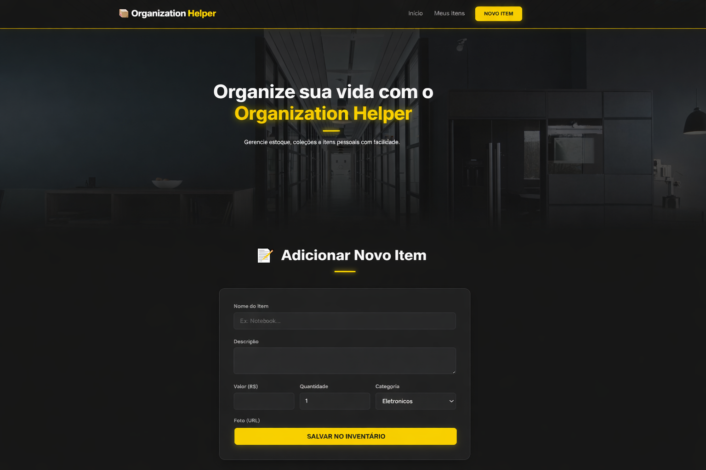
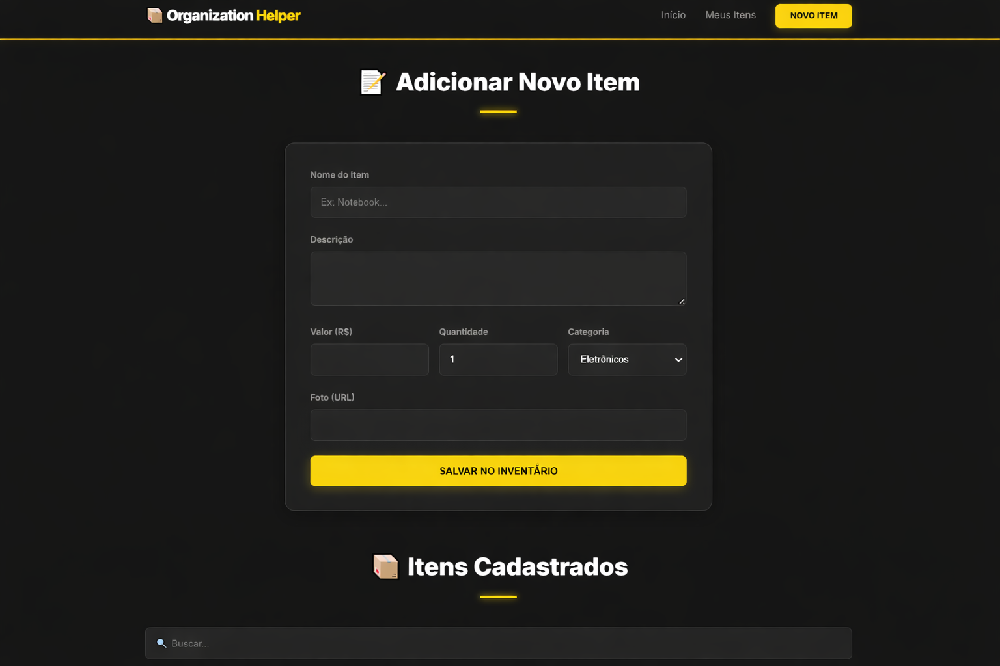

# Organization Helper

## 📌 Descrição
Sistema web desenvolvido para gerenciamento de itens e organização pessoal, permitindo cadastro, edição, listagem e exclusão de dados.

O sistema simula um ambiente real de controle de estoque ou organização de objetos pessoais.

---

## 🚀 Funcionalidades
- Cadastro de itens com nome, descrição, valor e categoria
- Listagem de itens cadastrados
- Filtro por categoria
- Busca de itens
- Exclusão e edição de dados
- Interface administrativa simples

---

## 🛠️ Tecnologias utilizadas
- HTML
- CSS
- JavaScript
- PHP
- SQL (Banco de dados)

---

## 💻 Diferenciais do projeto
- Integração com banco de dados
- Sistema CRUD completo
- Interface moderna e responsiva
- Simulação de sistema real de gestão

---

## 💼 Aplicação prática
Este projeto pode ser utilizado como base para:
- Sistemas de controle de estoque
- Gerenciamento de produtos
- Organização de dados pessoais

---

## ⚙️ Como executar
1. Instalar XAMPP ou similar
2. Importar o arquivo `sql.sql` no banco de dados
3. Rodar o projeto em servidor local
4. Acessar via navegador

---

## 📸 Preview

### Tela inicial

### Cadastro de itens

